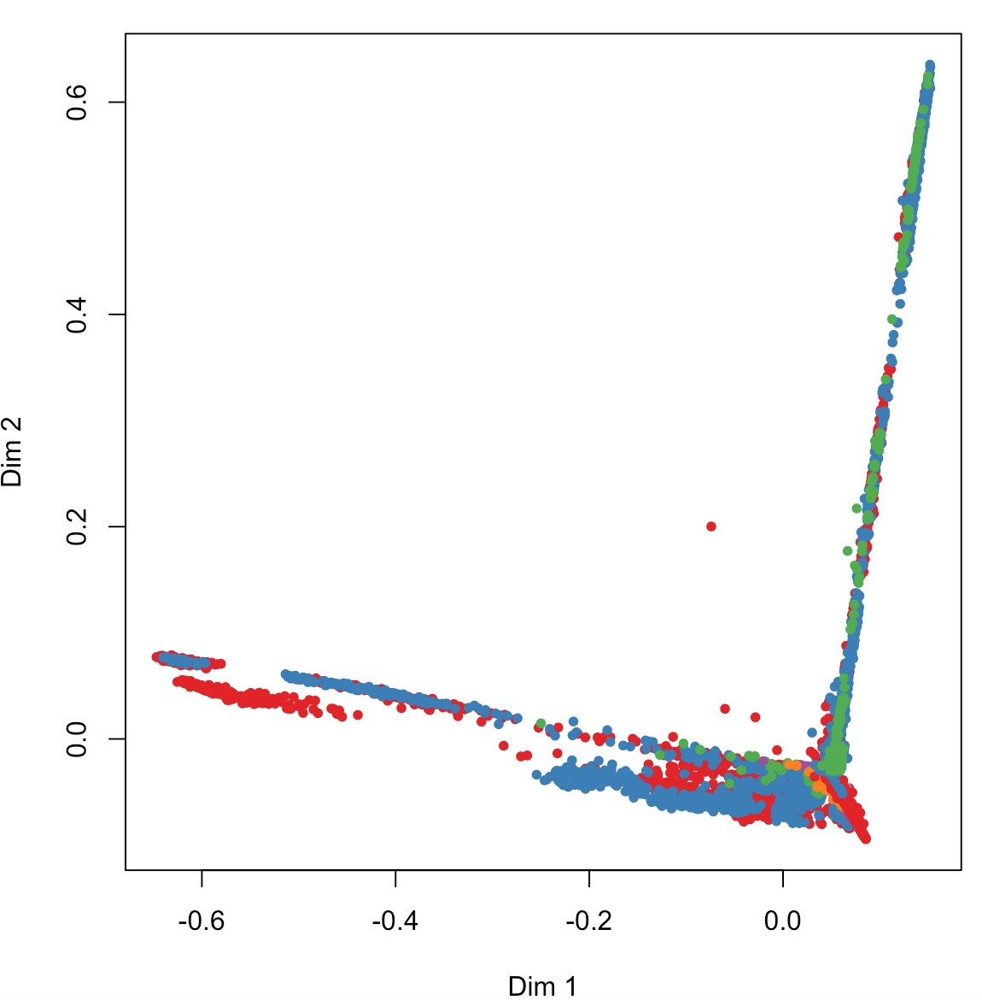

## Executive Summary

This purpose of this report is examine machine learning model selection (+ cross validation training), with the goal to conduct a series of exercise predictions given a dataset activity accelerometer recordings.

This report will have the following sections:

1. [Background](#background)
2. [Exploratory Analysis](#exploratory-analysis)
3. [Environment Setup](#environmental-setup)
4. [Tidy Data Phase](#tidy-data-phase)
5. [Preprocessing](#preprocessing)
6. [Model Selection](#model-selection)
7. [Model Choice](#model-choice)
8. [Quiz Dataset Predictions](#quiz-dataset-predictions)

## Background

Using devices such as Jawbone Up, Nike FuelBand, and Fitbit it is now possible to collect a large amount of data about personal activity relatively inexpensively. These type of devices are part of the quantified self movement – a group of enthusiasts who take measurements about themselves regularly to improve their health, to find patterns in their behavior, or because they are tech geeks. One thing that people regularly do is quantify how much of a particular activity they do, but they rarely quantify how well they do it.

The data collection is from accelerometers on the belt, forearm, arm, and dumbell of 6 participants. They were asked to perform barbell lifts correctly and incorrectly in 5 different ways. 

Details about the dataset and the manner it was collected can be found here.
<http://groupware.les.inf.puc-rio.br/har>

See the section on the Weight Lifting Exercise Dataset.

A special thank you to original source of this dataset:
Velloso, E.; Bulling, A.; Gellersen, H.; Ugulino, W.; Fuks, H. Qualitative Activity Recognition of Weight Lifting Exercises. Proceedings of 4th International Conference in Cooperation with SIGCHI (Augmented Human '13) . Stuttgart, Germany: ACM SIGCHI, 2013.

## Environment Setup

This method assists in loading up libraries and installing them if necessary.
```{r echo=TRUE, eval=TRUE}
usePackage<-function(p){
  # load a package if installed, else load after installation.
  # Args: p: package name in quotes
  if (!is.element(p, installed.packages()[,1])){
    print(paste('Package:',p,'Not found, Installing Now...'))
    suppressMessages(install.packages(p, dep = TRUE))}
  print(paste('Loading Package :',p))
  suppressMessages(require(p, character.only = TRUE))
}

usePackage("caret")
usePackage("ggplot2")
usePackage("rattle")
usePackage("randomForest")
usePackage("rpart")
usePackage("e1071")
```

## Exploratory Analysis

This section will initial examine the datasets on the accelerometers.  In order to reproduce all steps in this report, please pay attention to a few items necessary to prepare a proper working environment for your workstation.

```{r echo=TRUE, eval=TRUE}
# SET WORKING DIRECTORY
setwd("/Users/smallwes/develop/academic/coursera/datascience/c8-ml/project1/")
```
**NOTE**: *Please change this according to your directory system if you obtain these file from github*

File names in question:
```{r echo=TRUE, eval=TRUE}
trainingFilename <- "pml-training.csv" 
trainingFileUrl <- "https://d396qusza40orc.cloudfront.net/predmachlearn/pml-training.csv"
# Note: this training file will be used for model selection + split to training/testing partitions.

testingFilename <- "pml-testing.csv"
testingFileUrl <- "https://d396qusza40orc.cloudfront.net/predmachlearn/pml-testing.csv"
# Note: this testing file will be used post model selection and specifically for solving the quiz predictions.
```

Read datasets:

```{r echo=TRUE, eval=TRUE}
trainingDataset    <- read.csv( url(trainingFileUrl), header=TRUE )
quizTestingDataset <- read.csv( url(testingFileUrl),  header=TRUE)
```

Here is an initial set of summaries about the datasets. Due to the verbose nature, some of the actions below are commented as they display redundant information in different shapes.

```{r STR, echo=TRUE, eval=TRUE}
dim(trainingDataset)
dim(quizTestingDataset)
#View(trainingDataset)
str(trainingDataset, 1:20)
#summary(trainingDataset)
#head(trainingDataset)
#str(quizTestingDataset)
```

#### SUMMATION OF BASE DATASET FINDINGS:

1. "classe" column is located at the end; column 153
2. Model creation sees us relating the outcome to "all other columns" using formula "classe ~ ."
3. However a significant number of fields have invalid data in numeric columns - standardize "NA" data upon reading of the csv file.
4. A tidy-data phase shall occur identically on both training and the quiz testing dataset before before we engage in model building (cross validation, prediction, and comparison of models)


## Tidy Data Phase

This Tidy Data section including the next Preprocessing phase shall attempt to reduce the dataset to the best set of clean predictors ( and covariates).

We will do the following:
* Create dataframe with NA data specify na data: "NA", blanks, and unknown numeric values "#DIV/0!"
* Eliminate columns with no content including columns with NAs (i.e colmns max_roll_arm : num  NA NA NA NA NA NA NA NA NA NA ...)
* Remove columns with non helpful model building info, i.e. X, username, new window, time columns as we're not forecasting
* Given the lectures notes from the ML course, we could look at preprocessing the data with imputting, eliminating near-zero values, etc.

```{r TIDY, echo=TRUE, eval=TRUE}
# DEFINE EMPTY DATA SIGNATURES
naStringList = c("", "NA","#DIV/0!")

# RELOAD WITH NA COLUMNS SETTING
modelDF <- read.csv(url(trainingFileUrl), na.strings=naStringList, header=TRUE)

# SUBSET DF CLASS REQUIRED
classeColumn <- modelDF$classe
```

Initial report of the size of the training model dataset. We report on this a few times as we shrink the dataset based on a few techniquest.

```{r echo=TRUE, eval=TRUE}
dim(modelDF)
```

```{r REODER, echo=TRUE, eval=TRUE}
# REORDER COLUMNS ( MOVE CLASSE COLUMN TO START)
modelDF <- modelDF[,c(ncol(modelDF),1:(ncol(modelDF)-1))]
colnames(modelDF)[1]
```

```{r MINUS_COLS, echo=TRUE, eval=TRUE}
# EXPLICIT REMOVAL OF COLUMNS (NON HELPFUL; NOT NECESSARY FOR MODEL CREATION)
colnames(modelDF)[c(2:8)]
modelDF <- modelDF[,-c(2:8)]
dim(modelDF)
```

```{r NAs, echo=TRUE, eval=TRUE}
# REMOVE COLUMN WITH NAs
# Review: http://stackoverflow.com/questions/2643939/remove-columns-from-dataframe-where-all-values-are-na
modelDF <- modelDF[, unlist( lapply( modelDF, function(x) { !all(is.na(x) ) } ) ) ]
dim(modelDF)

getAnyNAColumnIndices <- function(modelDF) {
 output <- list(rep(FALSE, ncol(modelDF)))
 for (i in 1:ncol(modelDF)) {
   output[i] <- (length( which(is.na(modelDF[,i]))) !=0)
 }
 unlist(output)
}
#getAnyNAColumnIndices(modelDF)
modelDF <- modelDF[,!getAnyNAColumnIndices(modelDF)]
#str(modelDF)
dim(modelDF)
```

## Preprocessing
Machine learning algorithms learn from data. It is critical that producing the right data for the problem we want to solve comes from tidy data techniques and this section of preprocess.  The topics here were provide in machine learning lectures.

```{r NZV, echo=TRUE, eval=TRUE}
# REMOVING ZERO COVARIATES ( ML WK #2 LECTURE: COVARIATE CREATION )
nzvDF <- nearZeroVar(modelDF, saveMetric=TRUE, names=TRUE)
isAnyNZV <-any(nzvDF$nzv)
if (isAnyNZV) {
  modelDF <- modelDF[, -nzvDF]
}
dim(modelDF)
```
**NOTE:** *There were no near zero covariates to remove as* **isAnyNZV** *equals* **`r isAnyNZV`** 

```{r HC, echo=TRUE, eval=TRUE}
# REMOVE HIGHLY CORRELATED PREDICTORS ( ML WK #2 LECTURE: PREPROCESSION WITH PCA )
# Method obtained from: http://stackoverflow.com/questions/18275639/remove-highly-correlated-variables
corDF <- cor(modelDF[,-1])
hc <- findCorrelation(corDF, cutoff=0.8) #high correlated predictors matrix
hc <- sort(hc)
modelDF <- modelDF[,-c(hc + 1) ]
dim(modelDF)
```

**For further notes about the setp taken in preparation of this report see the PROJECT PROTYPE WIP R FILE.**

## Model Selection

# MODEL CHOICE: CROSS VALIDATION SUBSET TRAINING & TESTING

The training model dataset reduced from 153 columns to 40, is partitioned appropriately to perform cross validation.

```{r PARTITION, echo=TRUE, eval=TRUE}
set.seed(1234)
inTrain = createDataPartition(modelDF$classe, p = 0.6, list=FALSE)
training = modelDF[ inTrain,]
testing = modelDF[-inTrain,]
dim(training)
dim(testing)
```

#### Review of the caret library features:
```{r echo=TRUE, eval=FALSE}
?train
```

A few techniques about model seleciton were obtained after a review of the Caret library's Train command & TrainControl features found also in: 

<http://topepo.github.io/caret/bytag.html>

#### The Formula
Our primary formula used for all training of models is the following:
```{r echo=TRUE, eval=TRUE}
paramFormula <- classe ~ .
```

#### Training schemes
```{r echo=TRUE, eval=TRUE}
paramControl <- trainControl(
                    method = "repeatedCV", number = 10, repeats = 5, 
                    returnResamp = "all", classProbs = TRUE)

paramPreProcess <- c("knnImpute", "center","scale")
```

#### Fit Predictive Models:
Build a series of models based on the formula `r paramFormula`.

```{r RPARTA,echo=TRUE, eval=TRUE}
# TRAIN: RPART (using caret library's train)
set.seed(1234)
modelRpartA <- train(classe ~ ., method="rpart", data=training, preProcess=paramPreProcess)
```
```{r RPARTB, echo=TRUE, eval=TRUE}
# TRAIN: RPART (using rpart library)
set.seed(1234)
modelRpartB <- rpart(paramFormula, data=training, method="class")  # Outcome y is factor A -> E
```

```{r Svm, echo=TRUE, eval=FALSE}
# TRAIN: SVM-RADICAL (using caret library's train)
#set.seed(1234)
#modelSvm <- train(paramFormula, data=training, method="svmRadial")
# NOTE: DISABLED DUE TO MODEL TAKING TOO LONG TO GENERATE IN REPORT.
```

```{r RF, echo=TRUE, eval=TRUE}
# TRAIN: RF / RANDOM FOREST
#modelRF <- train(paramFormula, method="rf", data=training, preProcess=paramPreprocess, 
#                 trControl=paramControl, prox=TRUE,allowParallel=TRUE)

# ABORTING this  training model using "rf" = reason taking too long to complete even with optimized settings.
# http://stats.stackexchange.com/questions/37370/random-forest-computing-time-in-r

# NOTE: Switching to an optimizaed "random forest" library.
modelRandomForests <- randomForest(paramFormula, data=training,  proximity=TRUE, keep.forest=TRUE, importance=TRUE)
```

#### Examine R-PART Model Fit generated from Caret's Train

Decision Tree using RPART from Caret's Train Model Fit.
```{r FANCY1, echo=TRUE, eval=TRUE}
fancyRpartPlot(modelRpartA$finalModel)
```

#### Examine R-PART Model Fit generated from "RPart" Library

```{r FANCY2, echo=TRUE, eval=TRUE}
fancyRpartPlot(modelRpartB, palettes=c("Greys", "Oranges"))
```

#### Examine Random Forest Model Fit
A) The random forest model allows us to see the variable importance in a plot:
```{r varImpPlot, echo=TRUE, eval=TRUE}
varImpPlot(modelRandomForests)
```
B) Multi-dimensional Scaling Plot of a Proximity matrix within this Random Forest Model
**Note:* *Created offline due to lengthy generation*


#### Model Fit Accuracy Comparison:
A series of predctions are performed and we look at the cross-tabulation of observed & predicted classes. These statistics include a accuracy marker which is one of the most useful statstics.  For brevity, we'll use this statistic primarily in choosing the best performing model.

```{r PREDICTS, echo=TRUE, eval=TRUE}
predRpartA <- predict(modelRpartA, testing)
accuracyRpartA <- confusionMatrix(predRpartA,testing$classe)$overall['Accuracy']

predRpartB <- predict(modelRpartB, testing, type="class")
accuracyRpartB <- confusionMatrix(predRpartB,testing$classe)$overall['Accuracy']

#DISABLED DUE TO MODEL CREATION TAKING LONG
#predSvm <- predict(modelSvm, testing)
#accuracySvm <- confusionMatrix(predSvm,testing$classe)$overall['Accuracy']

predRandomForests <- predict(modelRandomForests, testing)
accuracyRandomForests <- confusionMatrix(predRandomForests,testing$classe)$overall['Accuracy']
```

| # | MODEL FIT | ACCURACY | 
|---|----------|--------|
| 1 | RPART A | `r accuracyRpartA` |
| 2 | RPART B  | `r accuracyRpartB` |
| 3 | SVM RADIAL | 0.91 (Approx) |
| 4 | RANDOM FOREST | `r accuracyRandomForests` |

## Model Choice
The best performing model fit is provided to use from RandomForest library. It contains an accuracy of **`r accuracyRandomForests`**, as provided as one of the more influencing statistics within the confusion matrix analysis.

```{r CONFUSION, echo=TRUE, eval=TRUE}
confusionMatrix(predRandomForests,testing$classe)
```

## Quiz Dataset Predictions

```{r QUIZA, echo=TRUE, eval=TRUE}
# LOAD QUIZ TESTING DATASET
quizTestingDF <- read.csv(url(testingFileUrl), na.strings=naStringList, header=TRUE)

# SUBSET COLUMNS OF QUIZ DATASET FROM THE COLUMNS REDUCED IN MODEL-DF
quiz <- quizTestingDF[, which(names(quizTestingDF) %in% colnames(modelDF))]
dim(quiz)
```

**Notably, there is no "classe" column in this dataset.  We'll just predict based on the other 30+ fields below.**

```{r QUIZB, echo=TRUE, eval=TRUE}
# PERFORM PREDICTIONS ON QUIZ TESTING DATASET
predict(modelRandomForests, quiz)
```

* * * 

### NOTES:

To see smallwesley's ML Project's Prototype WIP (Work in Progress), to which many more experiement were run before this Knitr RMD file was created see: 

[ml_project_prototype_wip.R](ml_project_prototype_wip.R)